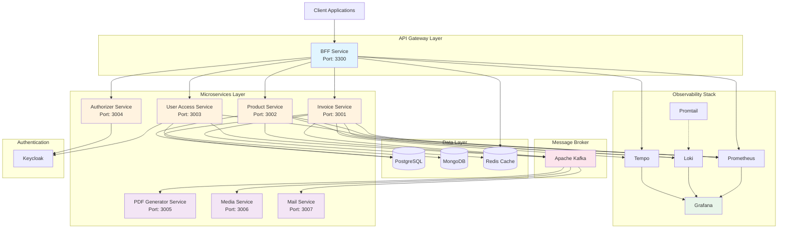
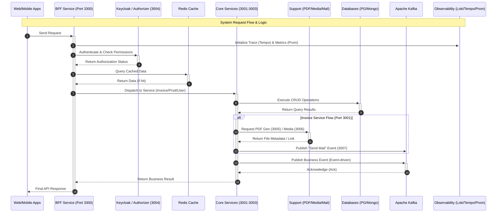

# InvoiveApp

# Microservices System

### Architecture Diagram

### Sequence Diagram

    Note over Obs: Asynchronous Monitoring & Logging
    Core-)+Obs: Push Logs (Loki) & Traces (Tempo)
    Kafka-)+Obs: Export Telemetry Data
